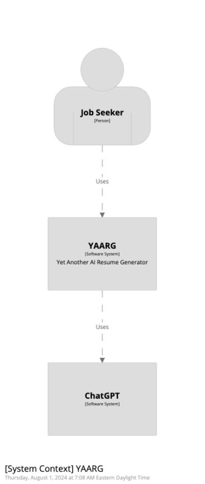
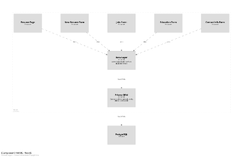

# YAARG (Yet Another AI Resume Generator)

Uses Next.js, Prisma, Postgresql

Demo site: https://yaarg.vercel.app/

## Local Development

### Environment File

Copy [.env.example](.env.example) to `.env`, modify as needed.

### Postgresql

I may eventually do this with docker compose or kubernetes:

```
docker pull postgres
docker run --name yaarg-postgresql -e POSTGRES_PASSWORD=yaarg -e POSTGRES_USER=yaarg -p 5432:5432 -d postgres 
npx prisma migrate dev
```

### Dev Server

After creating a .env file and database, run the development server:

`npm run dev`

Open [http://localhost:3000](http://localhost:3000) with your browser

### C4 Diagrams






To start the Structurizr server, run these commands:
```
docker pull structurizr/lite
docker run -it --rm -p 8080:8080 -v $(pwd)/structurizr:/usr/local/structurizr structurizr/lite
```

Then view at http://localhost:8080

### Known Issues

*   Resend authenticator throws an error in middleware, issue is described [here](https://github.com/nextauthjs/next-auth/issues/10632)